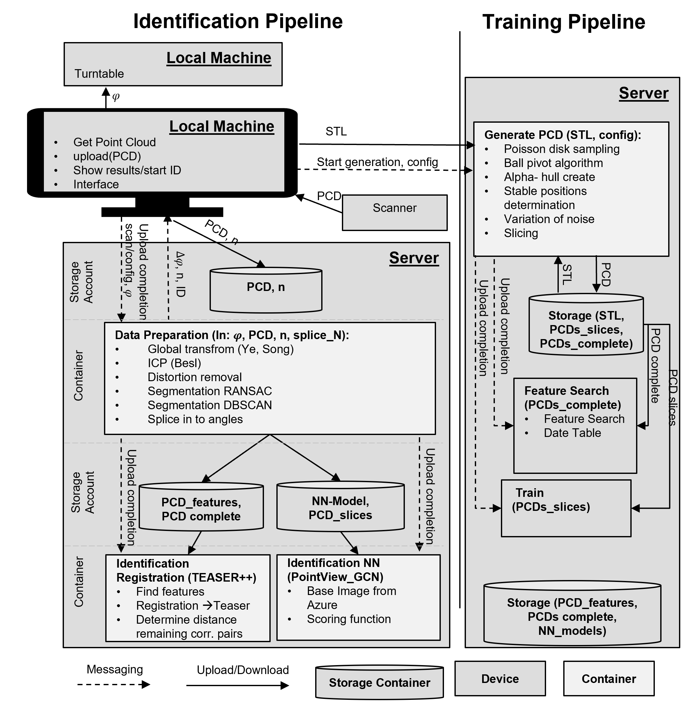

# BA: Computer Vision for Cost-Efficient Part Identification in Additive Manufacturing

## ID Pipeline

### LM

### Data Prep

### ID Registration
*Only runs in linux with teaser++ installation*

### ID NN
Uses modified DGCNN to identify pointcloud, ID 

