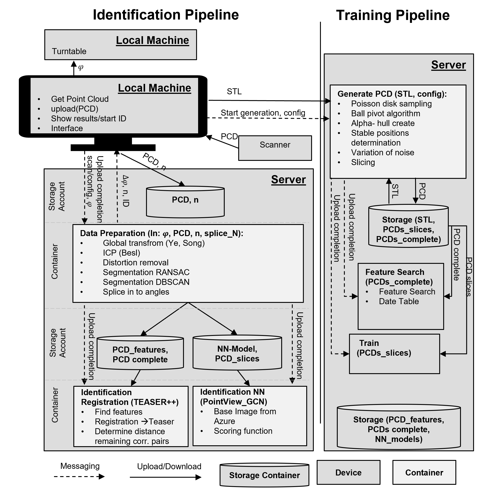
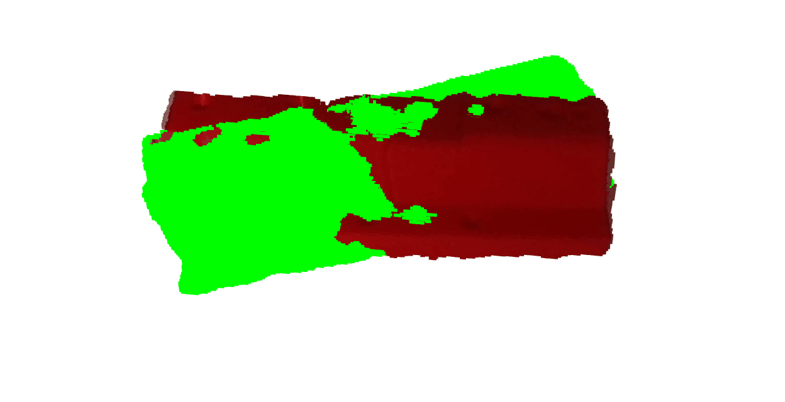

# BA: Computer Vision for Cost-Efficient Part Identification in Additive Manufacturing

## ID Pipeline

### LM
* upload.py
* log.py
* motorcontroller.py
* scan.py

### Data Prep
*edit config before using*
* Config
    * runs if config.pkl is unavailable
    * finds center turntable
    * finds ellipse distortion
    * finds y-axis distortion
* Normal
    * runs if config.pkl is available
    * loads pcd from storage *containerlmdp*
    * loads center and turntable plane
    * removes cylinder around center
    * runs DBSCAN
    * Turns pcd and applies 
    * filter out bad registration results with low correspondence pairs and high RMSE
    * uploads to *containerdpir*
    * 

### ID Registration
*Only runs in linux with teaser++ installation*
Runs parallelized over multiple containers
Follow steps:
1. Edit config to access service hub and storage account
2. Docker build and push image to azure container registry
3. Send out initialization message and ID message with the help of the [run_id.ipynb](IdentificationReg/run_id.ipynb)
4. Start multiple container instances of the same image
5. Accumulate results and save to csv in [run_id.ipynb](IdentificationReg/run_id.ipynb)

### ID NN
* Uses modified DGCNN to identify point cloud, uses model from ../TrainML. Choose the variation number to 
* The model is **not** translation variant all point clouds need to be centered using their average center of points using the open3d library. 
* Identification and evaluation with [test_ID.ipynb](IdentificationML/test_ID.ipynb). *remember to correct label order in labels.txt when generating new Dataset*

## Training Pipeline
Generate point cloud from STL

